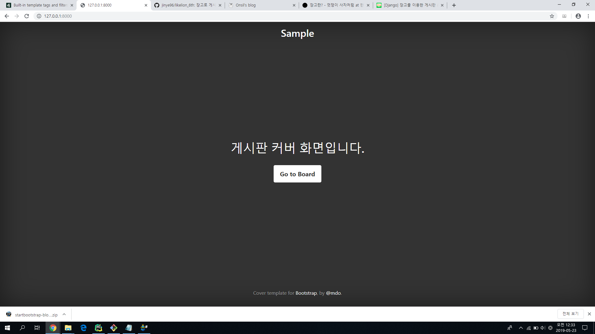
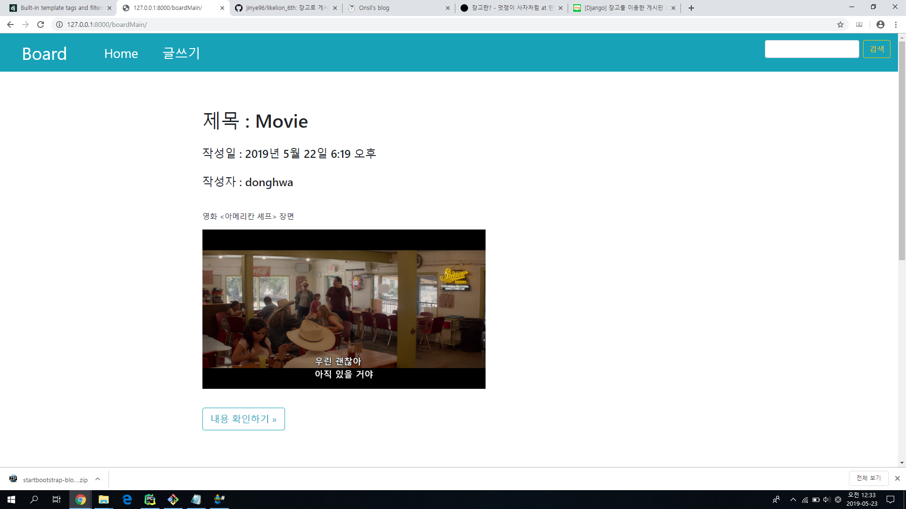
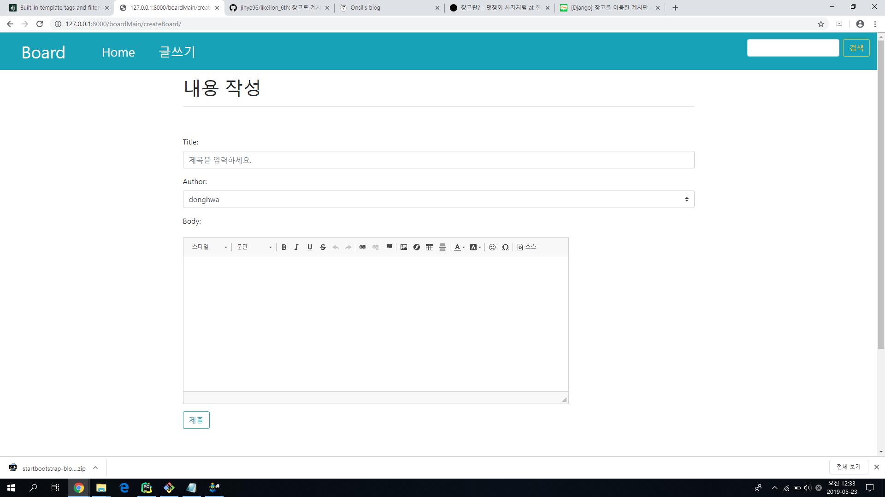
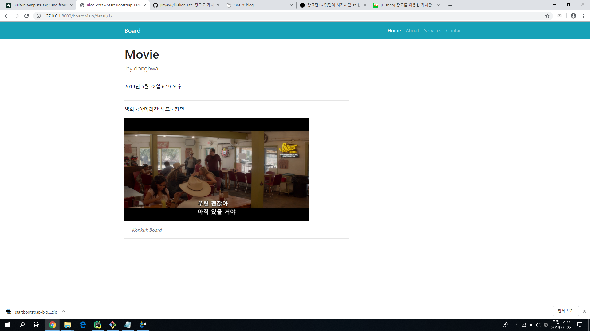

<h1>Django로 만드는 게시판</h1>
<h2>구현 의도</h2>

- 박동화: 간단한 취미 공유 게시판을 만들고 싶었습니다.
- 이지우: 게시판에 추천기능을 추가하고 싶었습니다.

<h2>오류 내용</h2>

-- 정말 수도 없이 많았다. 일단 제네릭뷰를 참고를 해서 틀을 만든 다음에 템플릿을 변경시키고 싶었지만 생각보다 제약이 많아 GenericView를 빼고 아예 view, model를 새로 만들어서 구성했다. GenericView를 포함해서 게시판을 만들려고 갖은 노력을 했지만 성공치 못했다. 그리고 디렉토리 구조 자체로 css연결이 안됐었고 정적 언어를 통해 하긴 했다. 

<h2>간단한 소감</h2>

결국 블로그를 참고해서 온전히 기능이 구현된다는 것 자체가 이 과제의 끝이였다. 확실히 많은 삽질을 통해 view,model,admin,settings,url, template, template_language등 많은 것을 알아낸 것에 기분은 좋지만 GenericView를 하지 않고 수정,삭제 기능을 구현시키지 못해서 너무 찝찝하다. 

<h2>참고문서 링크</h2>

https://docs.djangoproject.com/en/2.2/ref/templates/builtins/
- extends, block 등 템플릿 언어 (장고 사전)

https://onsil-thegreenhouse.github.io/menus/programming/django/
- 기본 장고 공부용

https://opentutorials.org/course/3718/24644
- 게시판 기본 틀(ckeditor 사용)

https://blog.naver.com/claude17/221289152154
- 제일 원하는 게시판이여서 제네릭뷰를 포함한채 짬뽕을 시켰지만 결국 실패했다. 설명도 잘 되어있고 투표에 추천,비추천 기능을 구현시킨 것이 좋았다. 

